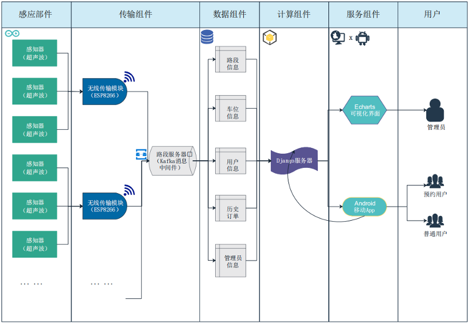
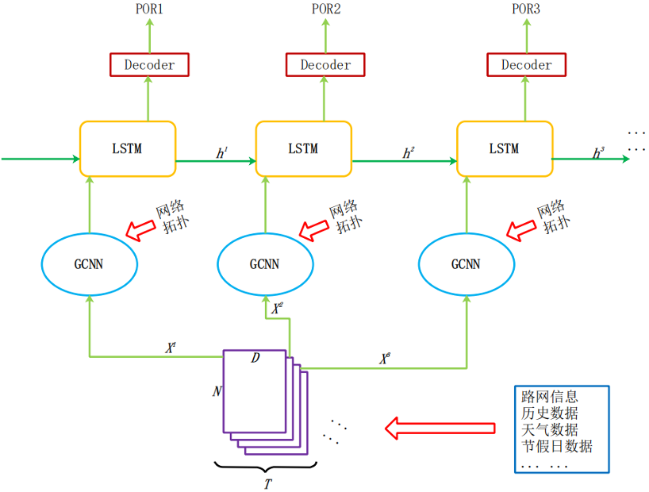
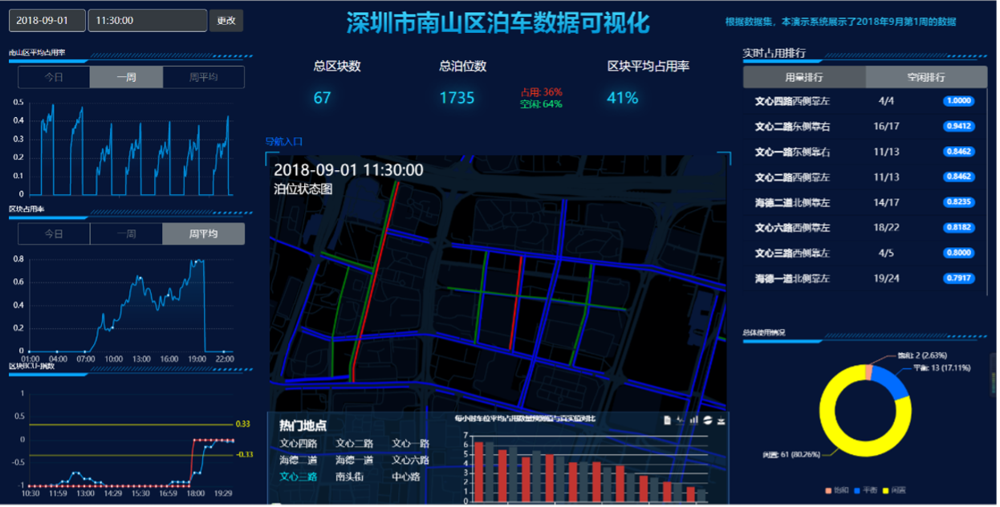
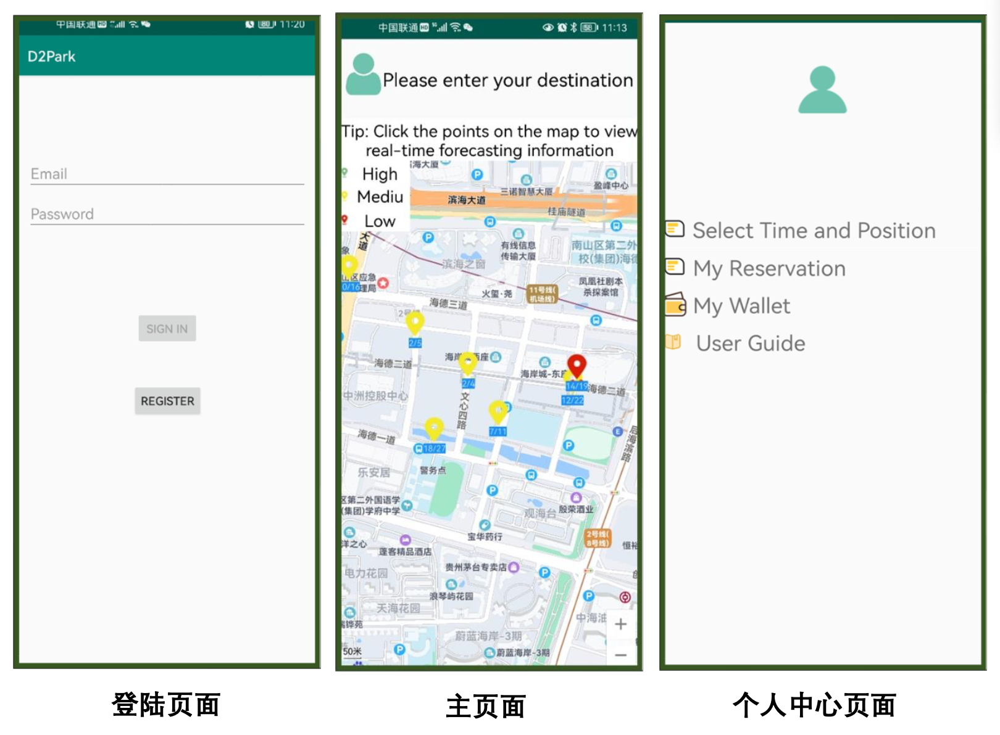
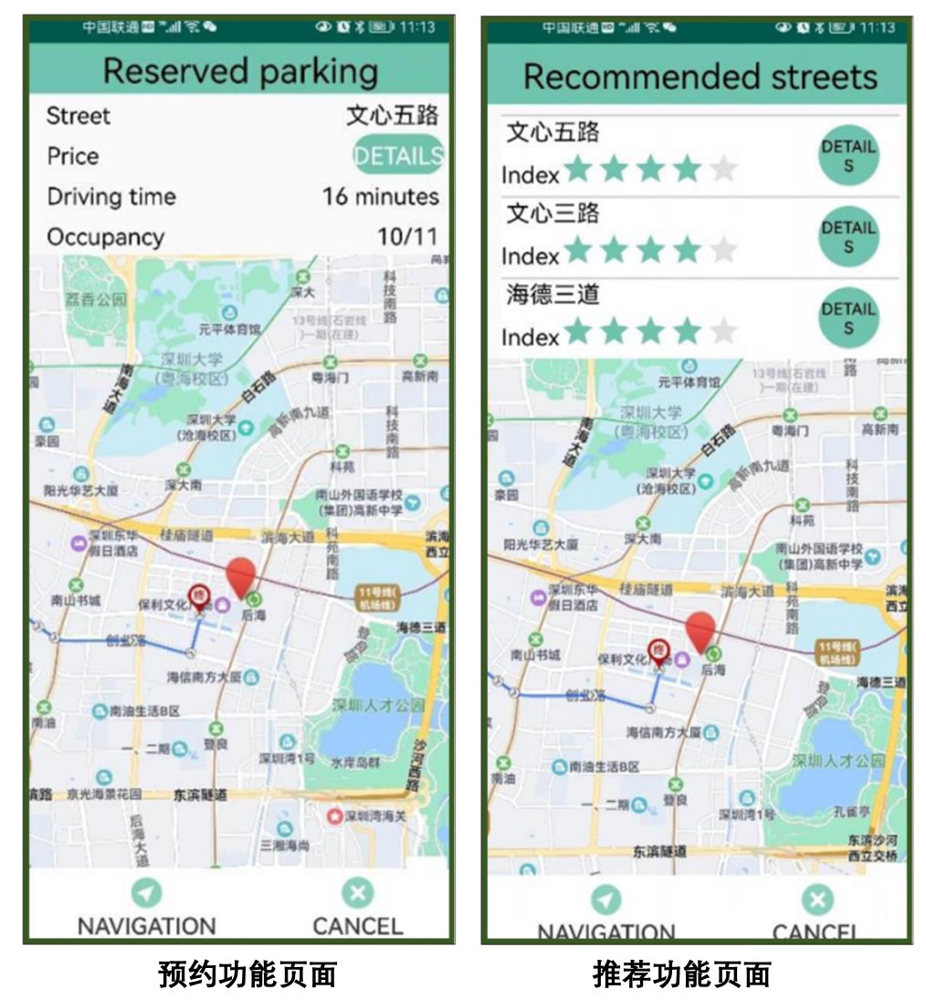

This project develops an integrated smart parking solution that employs real-time data and predictive analytics to streamline roadside parking. It addresses the critical need for efficient use of parking spaces, reducing congestion and environmental impact. The system serves motorists and city planners with user-friendly applications for spot prediction and reservation, fostering a more manageable and sustainable urban transportation environment.

Supervisor: Prof. [Dong Zhao](https://scholar.google.com/citations?hl=en&user=jZghsyQAAAAJ) and Assoc. Prof. [Pengfei Wang](https://scholar.google.com/citations?hl=en&user=BEDKYxUAAAAJ)
======

项目背景
======
智能交通兴起于欧美国家，上世纪六十年代起，欧美日等发达国家或地区交通拥堵、交通污染
排放、能源消耗过大及交通安全等问题日益严峻，而土地、能源等资源日益紧张，通过交通运输基 础设施过度建设扩张带来的负面影响日益凸现，迫切需要通过一些新技术运用，来提高运输质量 和效率。
智能交通的发展涉及到运载工具、交通基础设施、光电子信息、互联网等多个行业与技术领域 的交叉、融合，其大规模应用离不开多个行业和部门的联动。近年来，随着物联网、大数据、人工 智能等新兴技术的大力推动，智能交通系统有了长足发展。
交通对一个城市的影响从未像今天这样占据如此突出的地位，隐隐有成为城市发展第一牵引 力的势头。十几年来，随着我国城市化进程的提速、汽车数量的爆炸式增长，城市拥堵问题也日益 严重，与此相伴的是频繁的交通事故、噪声污染和空气污染，使城市承载能力与社会运行效率受到 了严峻挑战。因此，如何破解城市发展速度与社会效率的矛盾成了全社会普遍关注的问题。

项目目标
======
随着许多城市人口和车辆的持续增长，人们面临越来越严重的“停车难”问题，与此同时，大量的车位却没有得到充分利用。本产品旨在建立一套面向用户和城市管理部门的适用于城市停车资源紧张地区的停车管理系统。我们的目标是为有停车需求的用户提供停车位预测和预约分配功能，帮助用户更好地规划行程、提高用户停车效率，解决停车难问题；为城市管理部门提供智能定价和可视化数据分析功能，帮助他们及时了解停车场资源的使用情况，根据停车需求科学定价，提高停车管理水平。
本项目采用Web端和Android用户端相互补的产品模式，为政府决策部门、交管部门、私人企业以及个体车主四大目标服务对象提供技术支持。

本项目在构建边缘设施物联网的基础上，通过对各项停车数据的汇集和分类处理，使其能以直观清晰的形式展现在可视化界面上，为管理者和决策者们提供更高品质的交通服务，从而实现更加精细的运营管理。城市管理部门可以根据系统对于停车位占用情况的反应和停车高峰的预测结果做出反应，提前在可能出现拥堵的地段加派警力，疏通堵塞并且有效避免事故的发生，从而缓解停车难、管理难的严峻形势，也提高了人民群众获得感、幸福感，这对于完善民生工程具有重要意义。

项目概述
======

算法
======

界面展示
======

