This is an underwater image enhancement research, Vision Transformer and Wavelet Transform are used for underwater image
processing to avoid the current problems such as colour cast and detail blur.

# Supervisor: [Changjae Oh](http://eecs.qmul.ac.uk/~coh/)

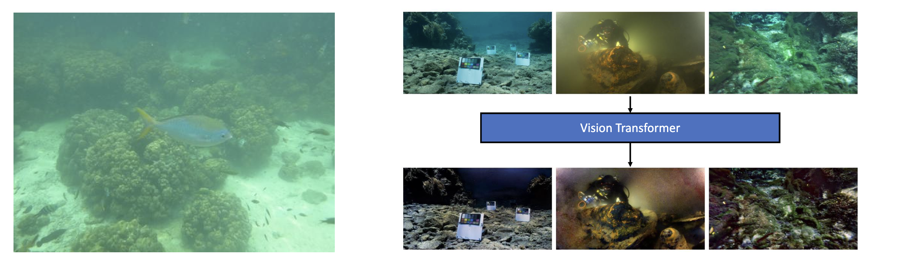

Abstract
======
People now give the development and utilization of marine resources more consideration. The area of underwater computer vision has seen a rise in research, particularly in the area of underwater robot detection of objects. However, because of scattering and attenuation that depends on wavelength and distance, underwater images have color casts and lack clarity. Convolutional neural networks ( CNNs) are frequently utilized in tasks connected to picture restoration since it has been demonstrated that they are effective at learning from large-scale data. In many computer vision tasks, the Vision Transformer(ViT) method outperforms traditional CNNs structures and has lately emerged as one of the primary neural network architectures for image processing. The article presents a Vision Transformer-based network to enhance the quality of underwater images. ViT is more efficient at capturing non-local contextual information than CNNs, improving the quality of underwater images. In order to be more precise, we deconstruct the input image using the discrete wavelet transform, create subsampled structure and detail images, and then input those images into the structure and detail networks. The issues of colour bias are solved using the structure network (SNet), while the issues of fuzzy image details are resolved using the detail network (DNet). The outcomes of the experiments show how well the suggested model handles the problems of color distortion and image blurring. We verified the excellent performance of the proposed model in processing the whole image and details on NYU-v2, UIEB, LSUI and ColorChecker.

Proposed Method
=====
## Overview
The network is splited into the structure network (SNet) and the detail network (DNet). We aim to deal with problems more efficiently and in a more targeted way.
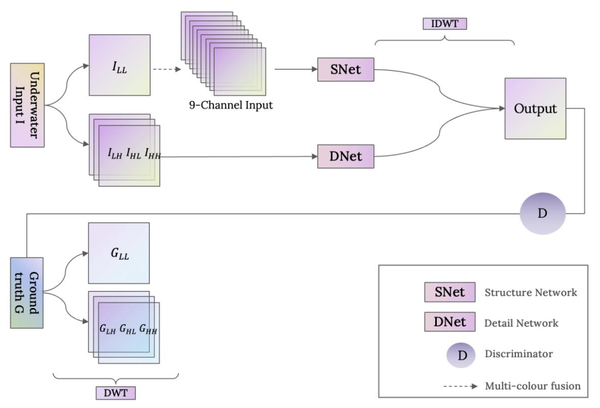

[//]: # ()
[//]: # (## Image Processing)

[//]: # ()
[//]: # (### Discrete Wavelet Decomposition&#40;DWT&#41;)

[//]: # (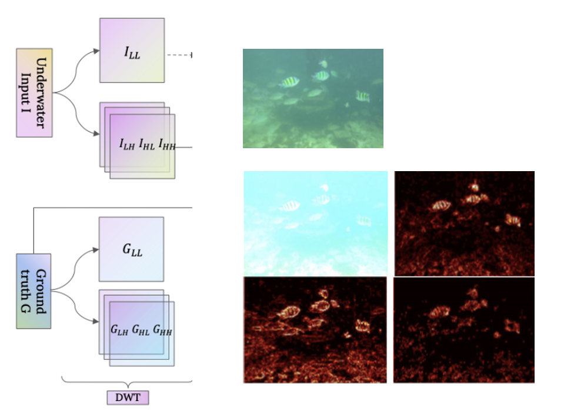)

[//]: # ()
[//]: # (### Multi-colour Space Fusion )

[//]: # (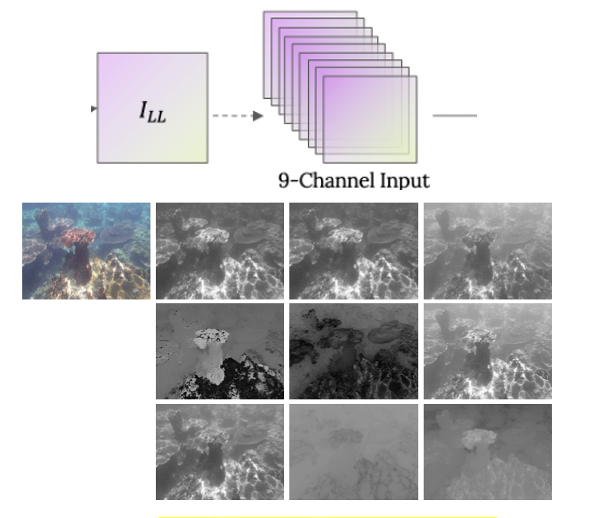)

[//]: # ()
[//]: # (## Structure Network)

[//]: # (Structure Network consists of Transformer module and conventional convolutional module. The model generally adopts U-net encoding and decoding structure to solve problems such as image colour bias.)

[//]: # (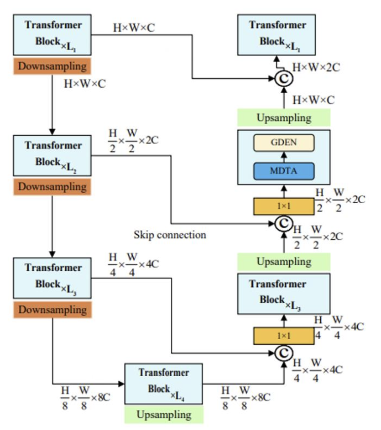)

[//]: # ()
[//]: # (## Detailed Network)

[//]: # (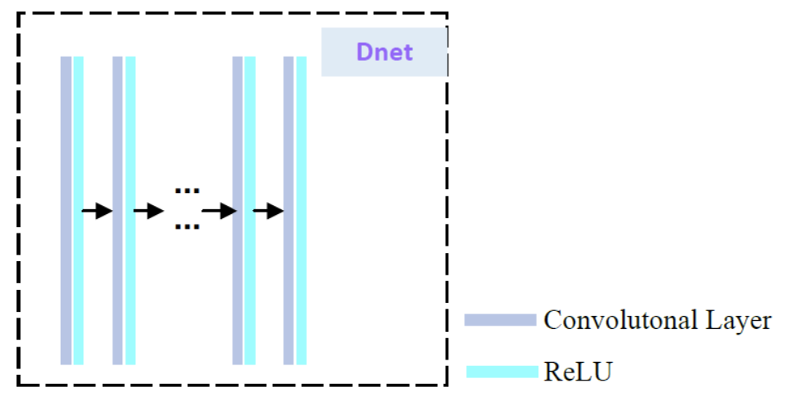)

[//]: # ()
[//]: # (## Loss Function)

[//]: # (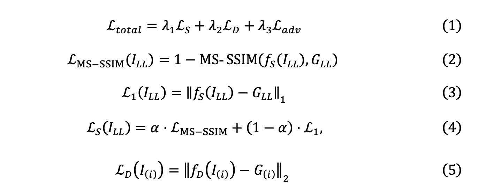)

Results
======
## Results on NYU-v2 dataset
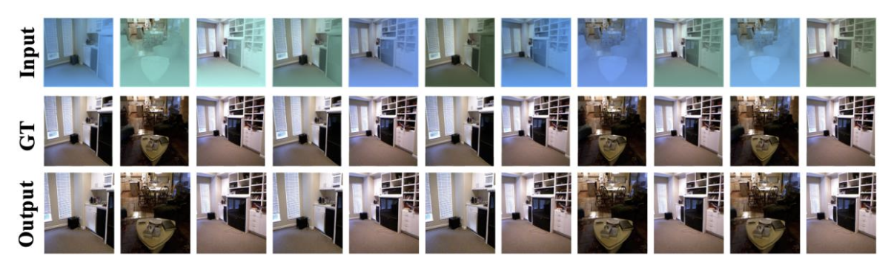

## Results on LSUI dataset
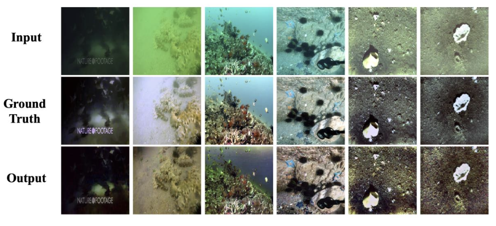

## Results on UIEB dataset
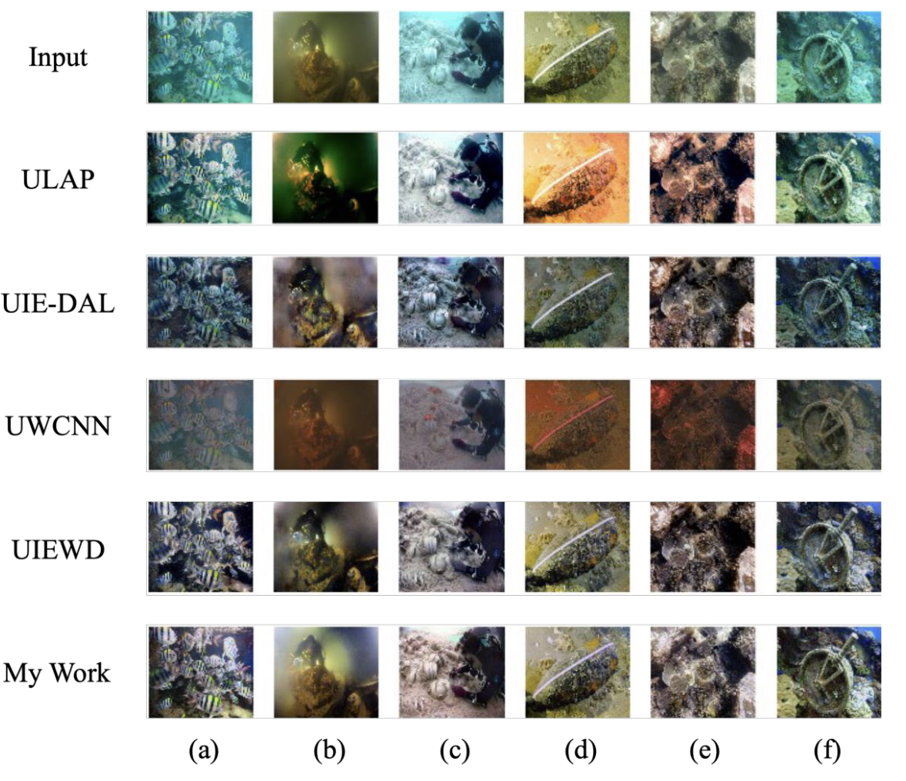

## Scores
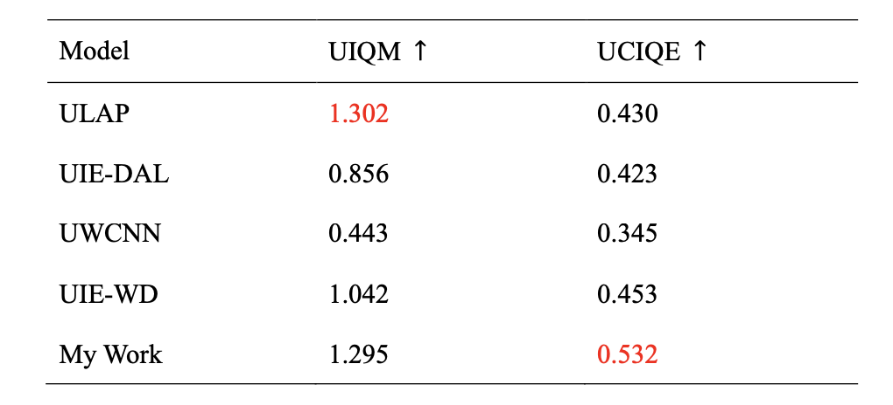