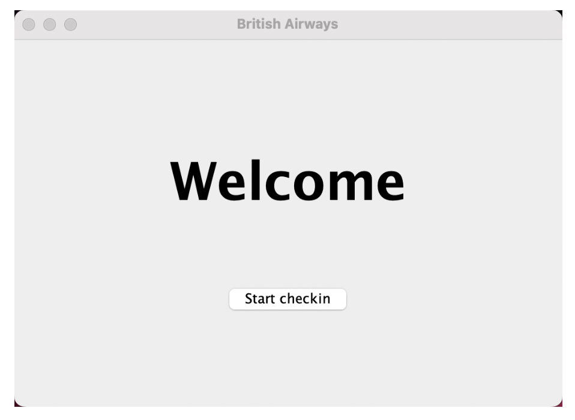
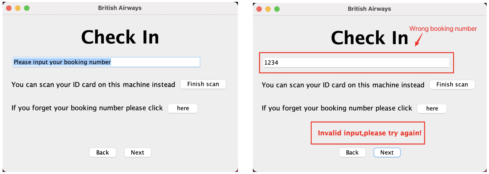
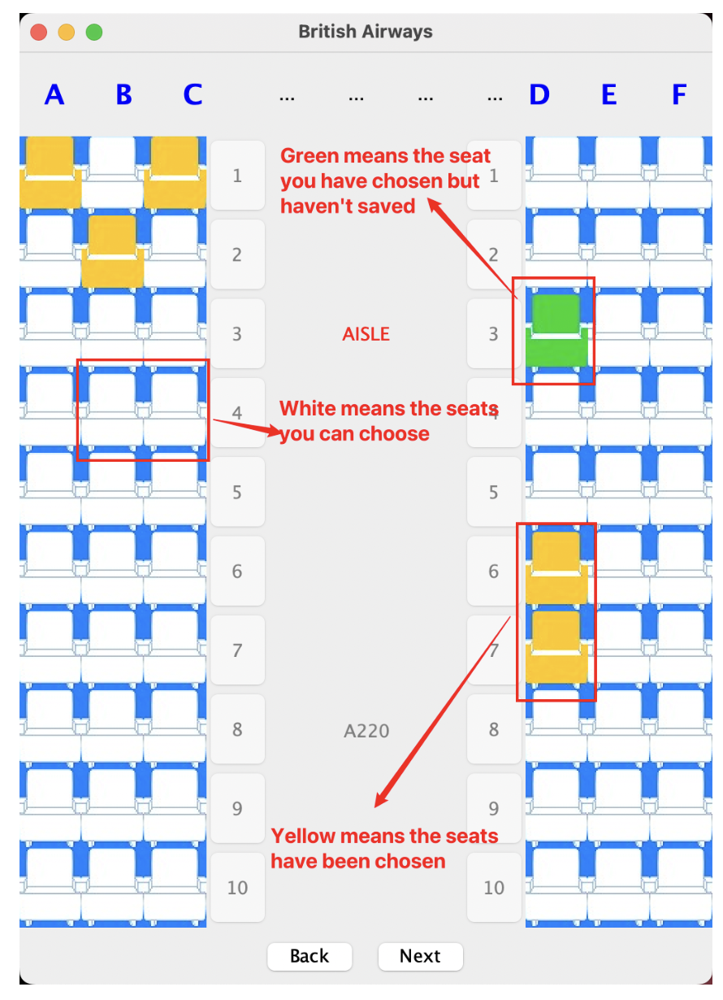
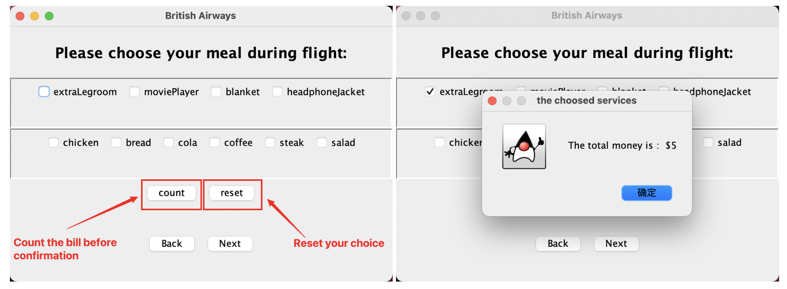
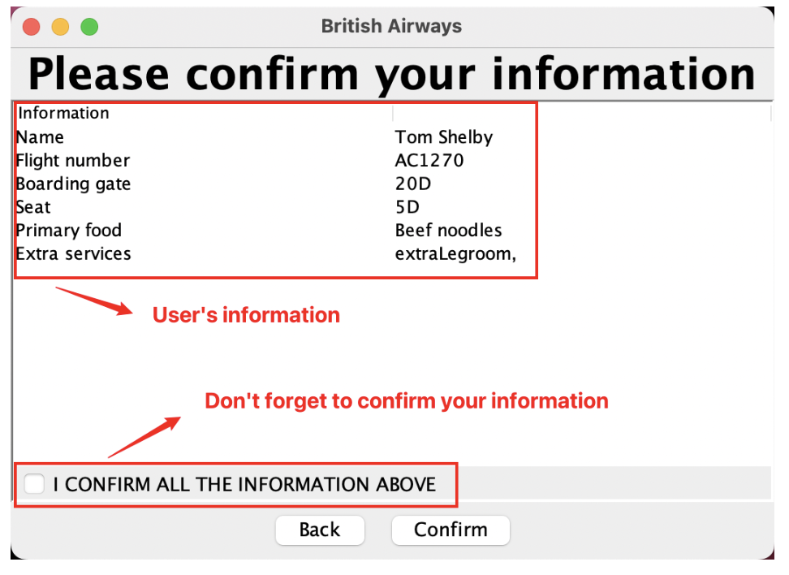

This project adopted a flexible and iterative approach to create a smart flight check-in kiosk. This innovative system aimed to expedite the airport check-in process, delivering an enhanced user experience. I played a key role in the technical development, utilizing Scrum methodologies to navigate the project through planning, development sprints, and quality assessments.

# Interface Presentation

# Project Repository
The whole project is published on Github, you can access this resource by [this link.](https://github.com/Ms-Wang01/Smart-Flight-Check-in-Kiosk)

