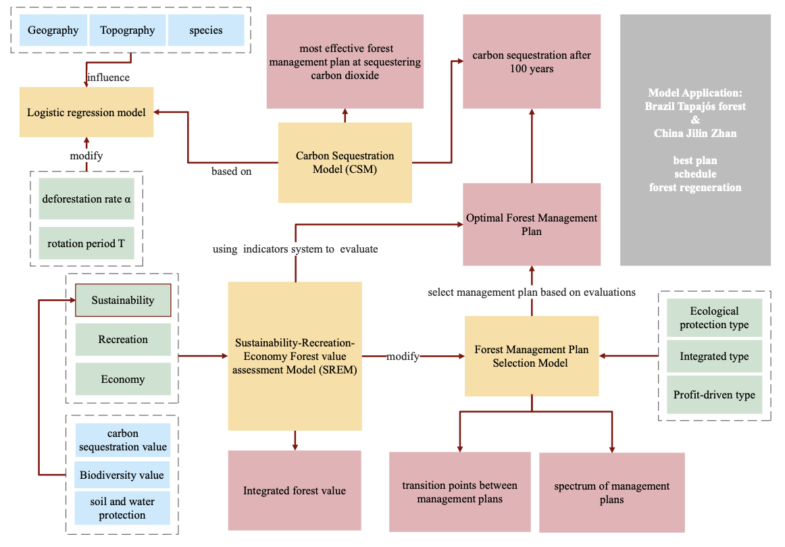
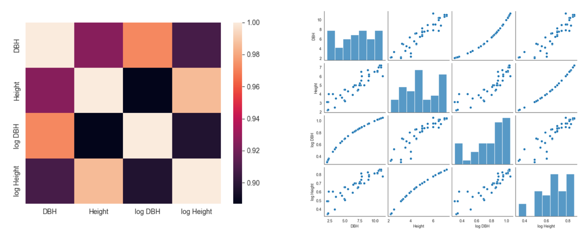
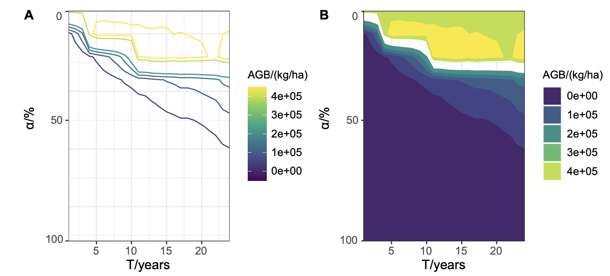
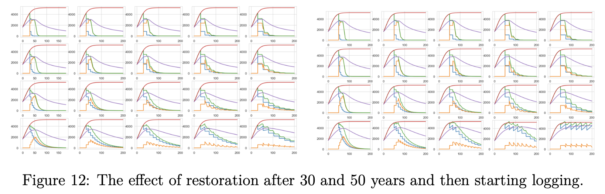
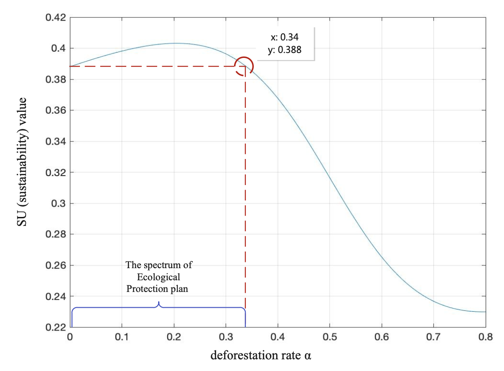

This project designed a framework to maximize forest carbon sequestration while considering economic and ecological values. The approach combines a Carbon Sequestration Model with a Total Value Evaluation Model, recommending a rotation period and cutting ratio tailored to forest type and stakeholder goals. For example, a 10-year rotation with a 24% cut optimizes carbon benefits, while a 25-year rotation with a 10% cut enhances biodiversity and long-term forest health.

# Supervisor: [Zequn Wei](https://teacher.bupt.edu.cn/weizequn/en/jsxx/245280/jsxx/jsxx.htm)

# Method Overview

# Results

